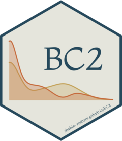

<!-- README.md is generated from README.Rmd. Please edit that file -->

# BC2

<!-- badges: start -->
<!-- badges: end -->

Fitting and evaluating Multivariate semi-continuous proportionally
constrained two-part fixed effects models.

## Installation

You can install the released version of BC2 (Version: 0.1.0) from
[github](https://github.com) with:

``` r
install.packages('devtools') #If you haven't installed it yet!

devtools::install_github('Shahin-Roshani/BC2')
```

## Links:

[Repository in github]()

[Package website for BC2]()

[Comprehensive vignette]()

[RPubs article]()
